# ESP32 WiFi-Enabled Relay

# Introduction
The ESP32 WiFi-enabled relay is a proof-of-concept project that allows the user to control multiple AC sockets connected to relays by either a physical button, web interface on a browser, repeating daily schedule, countdown timer, or with other programming languages from a server computer via a websocket connection.  

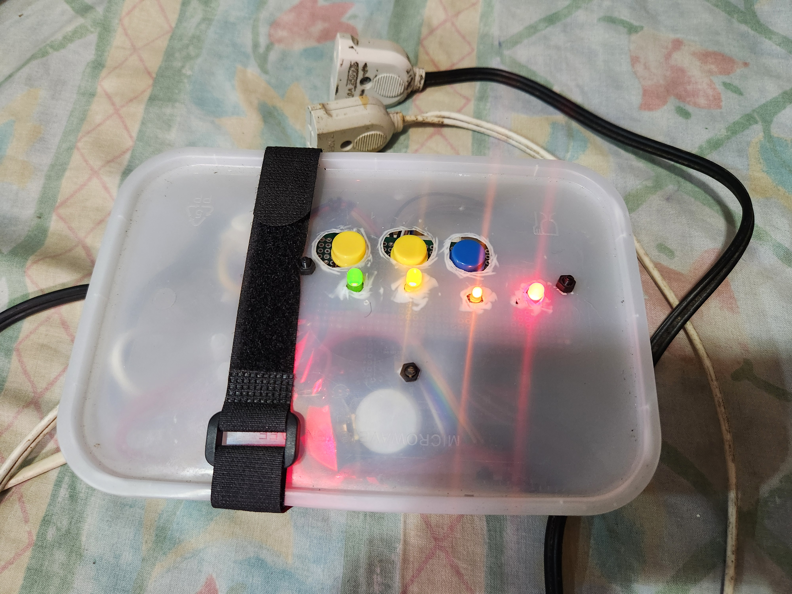
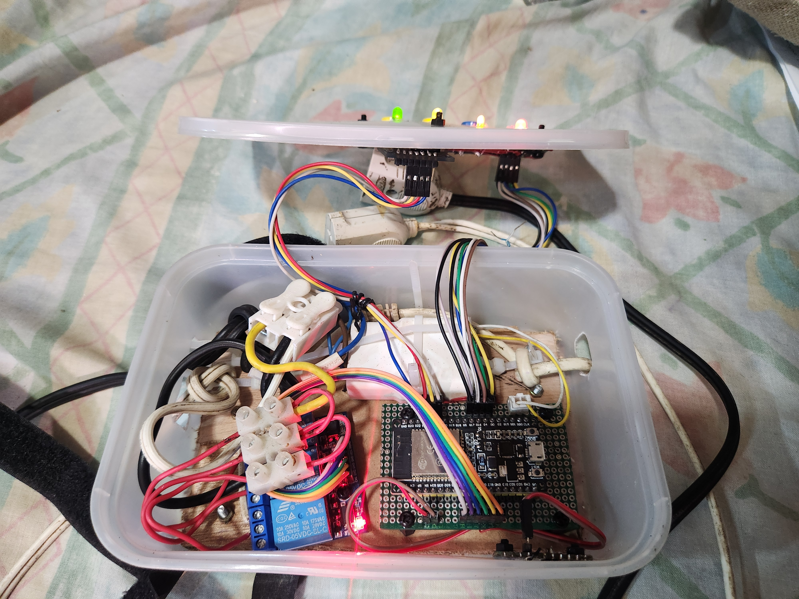
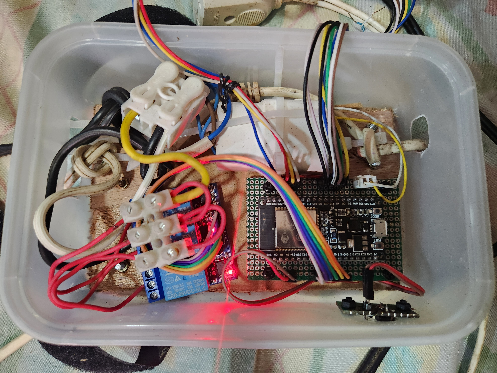

# Features
- Runs on an **ESP32**
- Three relays, but can be configured with more or less relays.
- Each relay functions independently of each other.
- Each relay has a **physical pushbutton** for **manual control** and **cycling through operating modes**, and a **status LED** to indicate its **operating mode** (either manual, daily timer, countdown timer, or disabled) and **current state** (either closed or open).
- The ESP32 can be **configured to connect to any WiFi hotspot** by configuring it from the browser of any mobile or desktop device, or **create its own hotspot** for standalone use.
- **Physical WiFi reset button** to reset the WiFi connection to factory defaults.
- **Web interface** accessible through the browser of any mobile or desktop device. 
- The web interface running on the browser communicates to the ESP32 via a **websocket connection**.
- Time is kept via a **real time clock (RTC)**, and can either be **set manually** or **synced automatically to network time protocol (NTP)**.
- All configuration is persistent and is saved to the flash of the ESP32. 

# Hardware 
## Hardware components
The ESP32 WiFi-enabled relay has the following hardware components:
- ESP32 
- 3.3V/5V relay module x3
- DS1307 RTC module
- LED x3 for relay status LEDs
- Momentary pushbutton x3 for relay control
- LED x1 for main status LED
- Momentary pushbutton x1 for WiFi reset pushbutton
- AC to 5V power supply module 
## Circuit Diagram
- **ESP32 PCB Circuit Diagram**

- **LEDs and Pushbuttons PCB Circuit Diagram**

- **WiFi Reset Pushbutton PCB Circuit Diagram**

## PCB Design 

- **ESP32 PCB**

- **LEDs and Pushbuttons PCB**

- **WiFi Reset Pushbutton PCB**

## Enclosure Design 

# Installation
## Prerequisite software: 
- VS Code
- PlatformIO extension for VS Code 
## Installation Procedure 
1. Download and install **VS Code**. 
2. Download the **PlatformIO extension** within the VS Code extension manager. 
3. Clone this project from Github.
4. Open the cloned project folder in VS Code.
5. Open the **PlatformIO toolbar** from the VS Code sidebar. Your editor must look like this:

6. Upload the program to the ESP32. Click on the **esp32doit-devkit-v1/General/Upload** option inside the PlatformIO toolbar. It might take a few minutes as PlatformIO downloads all the dependencies for the project.

7. Upload the filesystem image to the ESP32. Click on the **esp32doit-devkit-v1/Platform/Upload filesystem image** option inside the PlatformIO toolbar.

Installation complete. 

# Usage
## Relay Operating Modes
- **Manual mode** retains the state of the relay until the user changes it either on the web interface or the physical pushbutton.
- **Daily timer mode** allows the user to set multiple timeslots. Each timeslot has a start and end time which has a maximum duration of one day, and can be enabled or disabled. By default, the relay is open. When the current time falls within at least one enabled timeslot, the relay will be closed. 
- **Countdown timer** allows the user to set a countdown duration and manually start and stop the countdown timer. When the countdown timer is started, the relay will close until either the countdown timer reaches zero or is manually stopped, then the relay will remain open until the user restarts the countdown timer. The countdown duration is saved.
- **Disabled** - the relay is always open.
## Relay Pushbutton
Each relay has a **physical pushbutton** for **manual control** and **cycling through operating modes**
- **Single click**
    - In manual mode, a single click toggles the relay state.
    - In countdown timer mode, a single click (re)starts and stops the countdown timer.
    - No effect in all other modes. 
- **Double click** 
    - In any mode, double click cycles through all modes (manual mode - daily timer mode - countdown timer mode - disabled).
## Relay Status LED 
Each relay has a **status LED** to indicate its **operating mode** (either manual, daily timer, countdown timer, or disabled) and **current state** (either relay closed or relay open).
- **Current operation mode**
    - The relay LED blinks a number of times to indicate the current operation mode. It blinks once if the relay is in manual mode, twice if the relay is in daily timer mode, thrice if the relay is in countdown timer mode, and none if the relay is disabled.
- **Current relay state**
    - After indicating the current operation mode, the LED will turn on if the relay is currently closed, and turn off if the relay is currently open. 
## Configuring the WiFi connection
The ESP32 WiFi-Enabled relay can either produce its own WiFi hotspot in **station mode**, or connect to a WiFi hotspot in **access point mode**.
- Upon startup, the ESP32 will attempt to connect to the stored WiFi SSID (and password, if the WiFi is password secured). If it does not connect successfully for any reason, such as a nonexistent SSID or an incorrect password, it will automatically switch to access point mode and start its WiFi hotspot, which is an open WiFi network so that the user can connect to it to either use as-is, or to configure it to connect to their desired WiFi network.
- When the ESP32 is in access point mode, the ESP32 is accessible by connecting to the open WiFi network with SSID **ESP32_wifi_manager** and entering *http://192.168.4.1:7777/wifi.html* into the URL bar of the web browser. This opens up the ESP32 WiFi manager page. 

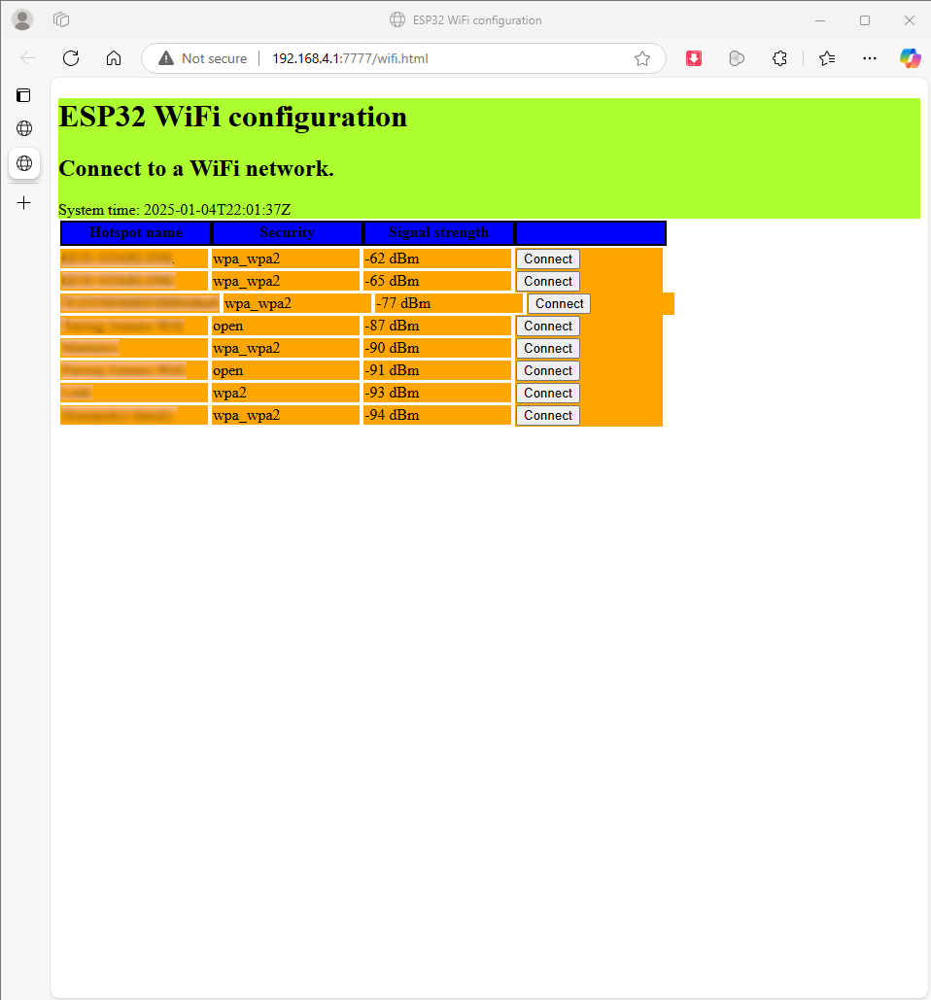

- Clicking the **Connect** button will direct the browser into the WiFi connect menu. Here, the user enters a WiFi password (if the WiFi is password secured) and the desired last octet of the IP address which ranges from 0-255. The last octet is used to set the *static IP address* of the ESP32 in the WiFi network it connects to so that it will be straightfoward to find and address the ESP32 in the network. The port number input is ignored because the port has been hardcoded to *7777*.

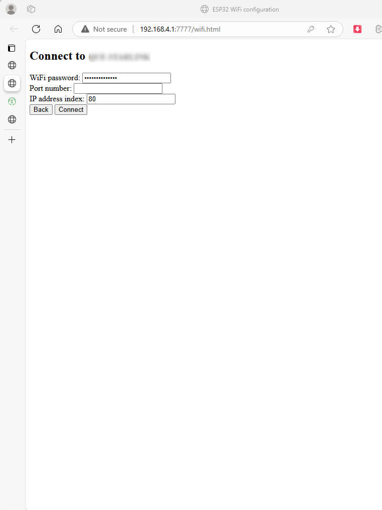

- A **reset pushbutton** allows the user to manually reset the WiFi credentials stored on the ESP32 even without having network access to the ESP32 so that the ESP32 will be reset into access point mode and the user can reconfigure the WiFi connection. **Long-pressing** the WiFi reset pushbutton until the main status LED blinks three times resets the WiFi credentials and restarts the ESP32. 

## Web Interface
The **web interface** allows the user to change various settings, including but not limited to the device name, relay operating modes, and relay state.
- **If the ESP32 is connected to a WiFi hotspot**, the web interface is accessible through the link *http://router_IP_subnet.ESP32_IP_index:7777/*. For example, if your WiFi router's network range is 192.168.5.0 to 192.168.5.255 and you set the ESP32 to have an IP address index of 80, then the URL to access the web interface is *http://192.168.5.80:7777/*.
- **If the ESP32 is in access point mode**, then its IP address is hardcoded  to *192.168.4.1*, so the URL to access the web interface is *http://192.168.4.1:7777/*. 
- The web interface allows the user to change the following configuration:
    - ESP32 device name
    - System date and time
    - Automatically sync time or set time manually 
    - main status LED setting
    - Relay status LED setting
    - Relay operation mode
    - Relay state (in manual mode)
    - Relay timeslots (in daily timer mode)
    - Relay countdown timer duration (in countdown timer mode)
- The web interface also displays status and information.
    - System date and time
    - Relay status
    - All settings
- The web interface communicates to the ESP32 via a **websocket connection**. This allows multiple ESP32 units on the same WiFi network to be programmatically controlled with the websocket libraries of various programming languages such as Python. The formats of the websocket messages are specified in *lib/Websocket_module/Webserver_module.h*.

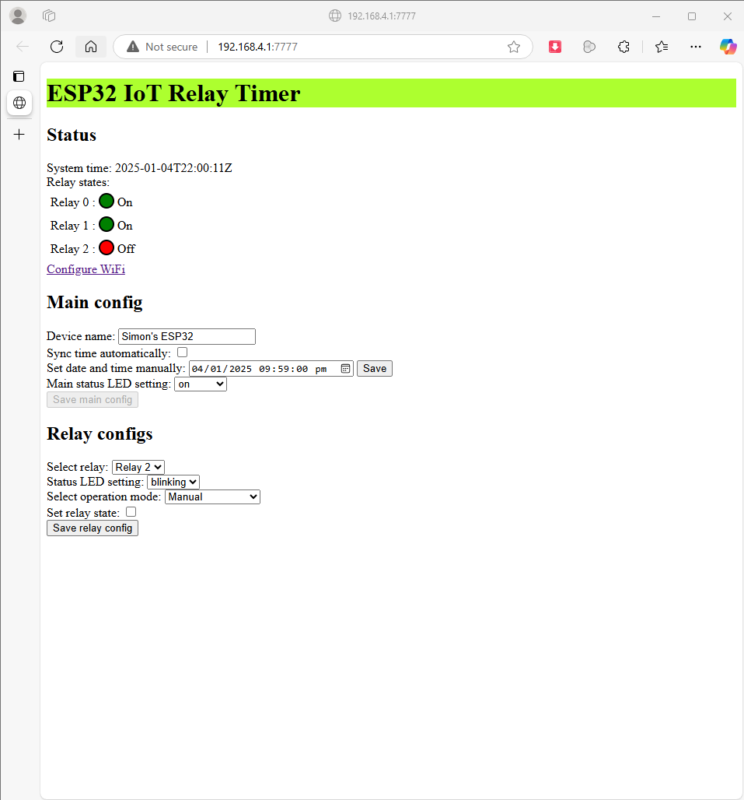

- Change the selected relay to view and manage its settings.

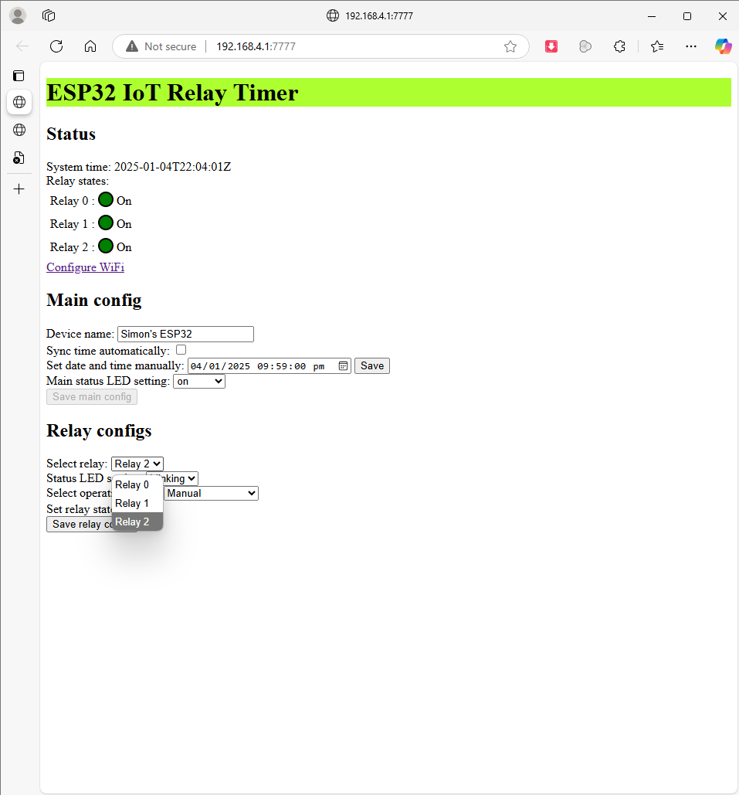

- Change the operation mode of the selected relay.

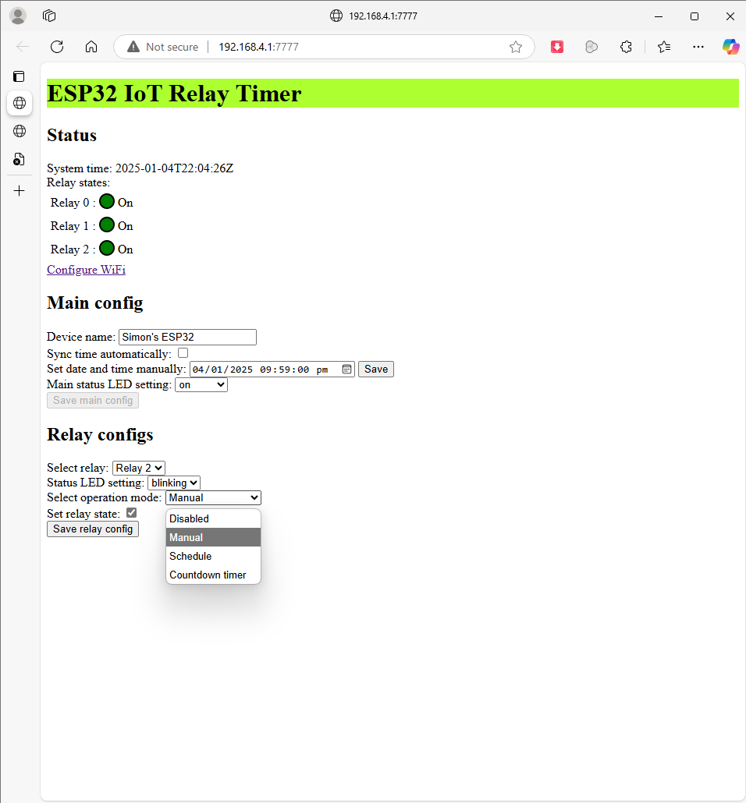

- When a relay is in **manual mode**, the relay state can be changed.

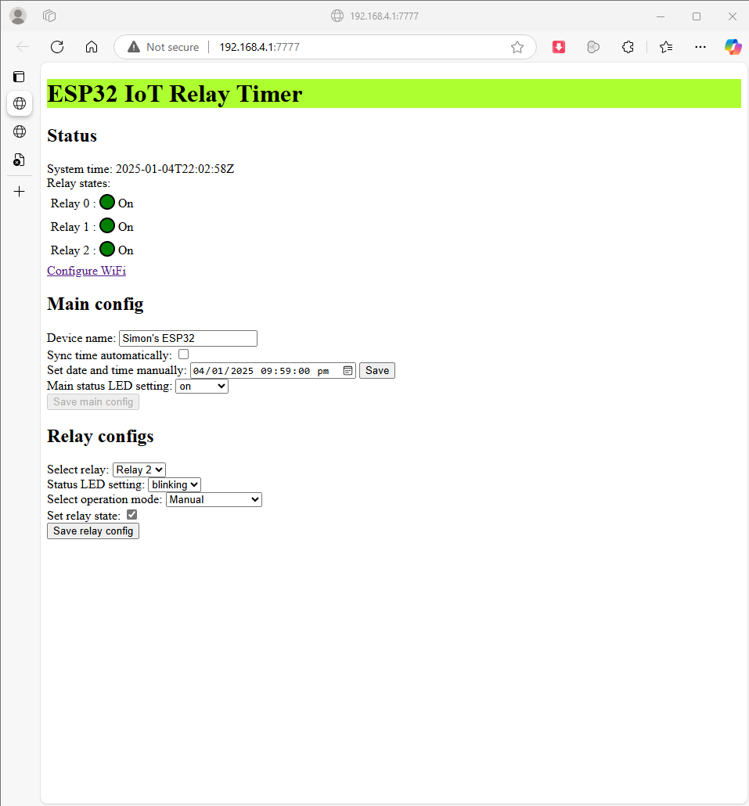

- When a relay is in **daily timer mode**, the start time, end time, duration, and enabled setting of each timeslot can be changed.

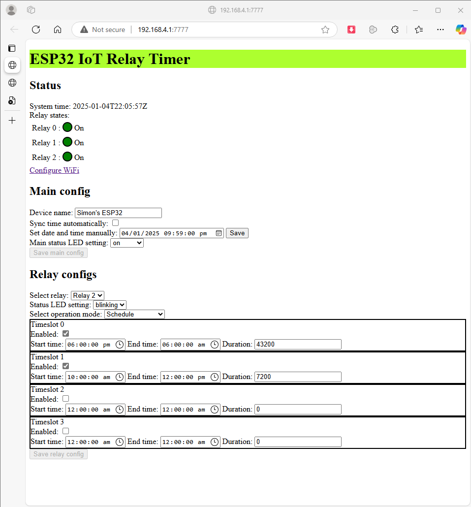

- When a relay is in **countdown timer mode**, the countdown timer duration in seconds can be changed and the countdown timer can be started and stopped.

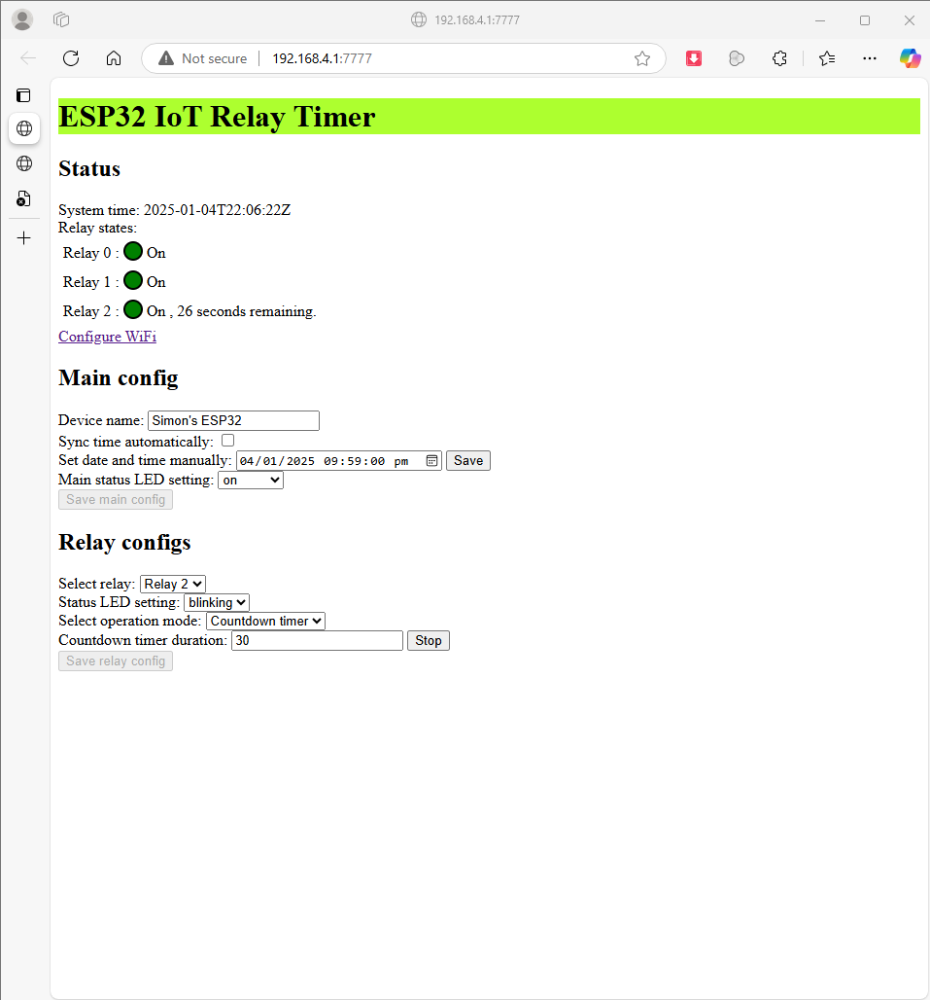

- There are countdown timers in the relay status indicators that indicate how much time the relay countdown timer has left before the relay opens.

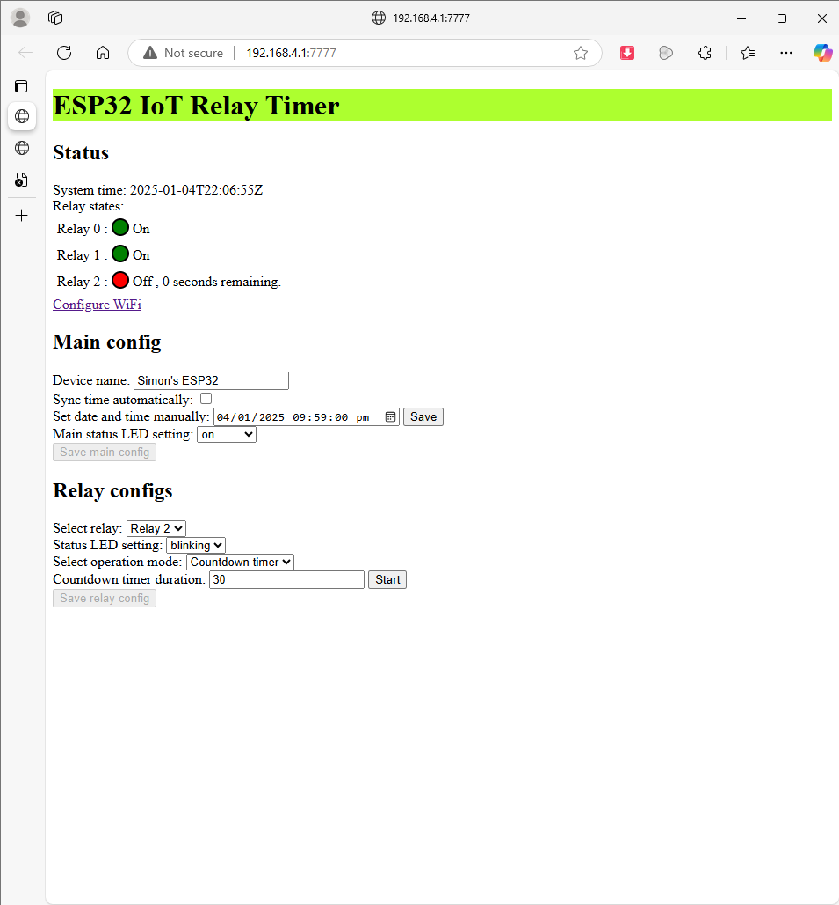

