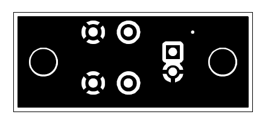

# ESP32 IoT Relay

# Introduction
The ESP32 WiFi-enabled relay is a proof-of-concept project that allows the user to control multiple AC sockets connected to relays by either pressing a physical button, pressing a button on the webpage on a browser, setting a repeating daily schedule, or a one-time countdown timer.  

# Features
- Runs on an **ESP32**
- Three relays, but can be configured with more or less relays.
- Each relay has a **physical pushbutton** for **manual control** and **cycling through operating modes**, and a **status LED** to indicate its **operating mode** (either manual, daily timer, countdown timer, or disabled) and **current state** (either closed or open).
- The ESP32 can be **configured to connect to any WiFi hotspot** by configuring it from the browser of any mobile or desktop device.
- **Physical WiFi reset button** to reset the WiFi connection to factory defaults.
- **Web interface** accessible through the browser of any mobile or desktop device. 
- The web interface running on the browser communicates to the ESP32 via a **websocket connection**.
- Time is kept via a **real time clock (RTC)**, and can be **set manually** or **sync automatically to network time protocol (NTP)**.
- All configuration is persistent and is saved to the flash of the ESP32. 

# Hardware 
## Hardware components
The ESP32 WiFi-enabled relay has the following hardware components:
- ESP32 
- 3.3V relay module x3
- DS1307 RTC module
- LED x3 for relay status LEDs
- Momentary pushbutton x3 for relay control
- LED x1 for main status LED
- Momentary pushbutton x1 for WiFi reset pushbutton
- AC to 5V power supply module 
## Circuit Diagram
- ESP32 PCB Circuit Diagram

- LEDs and Pushbuttons PCB Diagram

- WiFi Reset Pushbutton PCB Diagram

## PCB Design 
- ESP32 PCB

- LEDs and Pushbuttons PCB

- WiFi Reset Pushbutton PCB

## Enclosure Design 

# Installation
## Prerequisite software: 
- VS Code
- PlatformIO extension for VS Code 
## Installation Procedure 
1. Download and install **VS Code**. 
2. Download the **PlatformIO extension** within the VS Code extension manager. 
3. Clone this project from Github.
4. Open the cloned project folder in VS Code.
5. Open the **PlatformIO toolbar** from the VS Code sidebar. Your editor must look like this:

6. Upload the program to the ESP32. Click on the **esp32doit-devkit-v1/General/Upload** option inside the PlatformIO toolbar. It might take a few minutes as PlatformIO downloads all the dependencies for the project.

7. Upload the filesystem image to the ESP32. Click on the **esp32doit-devkit-v1/Platform/Upload filesystem image** option inside the PlatformIO toolbar.

8. Installation complete. 

# Usage
## Relay Operating Modes
- **Manual mode** retains the state of the relay until the user changes it either on the web interface or the physical pushbutton.
- **Daily timer mode** allows the user to set multiple timeslots. Each timeslot has a start and end time which has a maximum duration of one day, and can be enabled or disabled. By default, the relay is open. When the current time falls within at least one enabled timeslot, the relay will be closed. 
- **Countdown timer** allows the user to set a countdown duration and manually start and stop the countdown timer. When the countdown timer is started, the relay will close until either the countdown timer reaches zero or is manually stopped, then the relay will remain open until the user restarts the countdown timer. The countdown duration is saved.
- **Disabled** - the relay is always open.
## Relay Pushbutton
- **Single click**
    - In manual mode, a single click toggles the relay state.
    - In countdown timer mode, a single click (re)starts and stops the countdown timer.
    - No effect in all other modes. 
- **Double click** 
    - In any mode, double click cycles through all modes (manual mode - daily timer mode - countdown timer mode - disabled).
## Relay Status LED 
- **Current operation mode**
    - The relay LED blinks a number of times to indicate the current operation mode. It blinks once if the relay is in manual mode, twice if the relay is in daily timer mode, thrice if the relay is in countdown timer mode, and none if the relay is disabled.
- **Current relay state**
    - After indicating the current operation mode, the LED will turn on if the relay is currently closed, and turn off if the relay is currently open. 
## Configuring the WiFi connection
- If the ESP32 fails to connect to the configured WiFi, it will automatically start its WiFi hotspot, which is an open WiFi network so that the user can connect to it to either use it as-is, or to connect it to their desired WiFi network.  
- A **reset pushbutton** allows the user to reset the WiFi credentials stored on the ESP32 so that the user can reconfigure the WiFi connection of the ESP32. 
## Web Interface
- The **web interface** allows the user to change various settings, including but not limited to the device name, relay operating modes, and relay state.
- The ESP32 can either produce its own WiFi hotspot in **station mode**, or connect to a WiFi hotspot in **access point mode**.
- the **time** can be set either **manually** or **automatically synced to NTP**.
- Each relay functions independently of each other.
- The web interface communicates to the ESP32 via a **websocket connection**. This allows multiple ESP32 units on the same WiFi network to be programmatically controlled with the websocket libraries of various programming languages such as Python. The formats of the websocket messages are specified in .